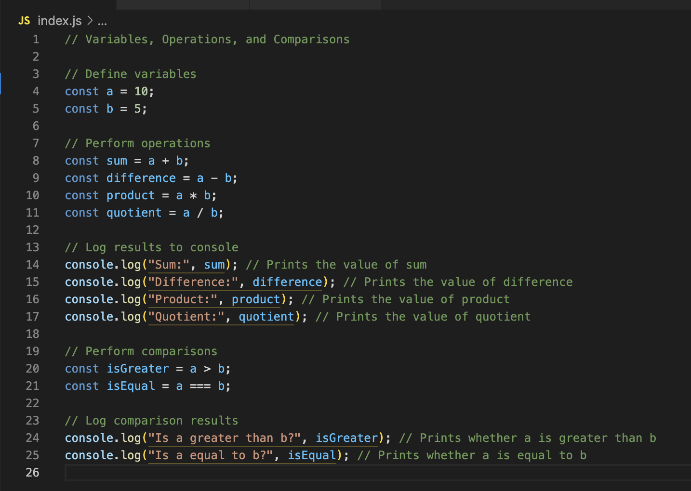

# Variables, Operations, and Comparisons

##

## Description 📄
In this assignment, you will work with JavaScript to define variables, perform basic arithmetic operations, and use comparison operators to evaluate expressions. You will learn how to declare variables using const, perform calculations such as addition, subtraction, multiplication, and division, and compare values to determine relationships like equality and greater-than conditions. This exercise will help you understand the basics of data manipulation and logical comparisons, which are essential skills for any JavaScript programmer.


## Expected Project Structure 🏗️

```plaintext

js_operations/
└── index.js

```

# Instructions ✅

## 1. **Create the Project Folder and Files**
   - [ ] Create a folder named `js_operations` to store all your project files.
   
   - [ ] Inside the `js_operations` folder, create a file named `index.js`. This will be your JavaScript file.
   
## 2. **Adding a Comment at the Top**
Let's start by adding a comment at the top of your JavaScript file to describe what the script does. 

  - [ ] Open your index.js file inside the js_operations folder and add the following comment to it:

```javascript

// This script defines variables, performs basic arithmetic operations, and compares values in JavaScript.

```

**Explanation:**
- This comment describes the purpose of the script. Adding comments is a good practice as it helps to document your code and make it more readable. Comments are essential for explaining your code and making it easier to understand for yourself and others.

## 3. **Let's Add Some Variables**
Next, let's add some variables to your script. Variables are used to store data that can be used and manipulated throughout your program.

- [ ] Start by adding a comment to indicate the beginning of the variable definitions.

```javascript

// Define variables for arithmetic operations

```

- [ ] Next, add the following code to define the first variable.

```javascript

const a = 10;

```

- [ ] Add another comment to describe the next variable.

```javascript

// Second variable to use in operations

```

- [ ] Finally, add the second variable to your `index.js` file.

```javascript

const b = 5;

```

**Explanation:**
In this step, we added comments for clarity and defined two constant variables, a and b, with values 10 and 5. These variables are set up for use in later calculations, and using const ensures their values remain unchanged throughout the script. This helps keep our code organized and easy to understand.
##

## 4. **Perform Operations**
In this step, you will perform basic arithmetic operations using the variables you defined earlier. 

  - [ ] Start by adding a comment to indicate the beginning of the operations section.

```javascript
// Perform operations
```

  - [ ] Add the code to calculate the sum of `a` and `b`.

```javascript
const sum = a + b;
```

  - [ ] Add the code to calculate the difference between `a` and `b`.

```javascript
const difference = a - b;
```

  - [ ] Add the code to calculate the product of `a` and `b`.

```javascript
const product = a * b;
```

  - [ ] Add the code to calculate the quotient of `a` divided by `b`.

```javascript
const quotient = a / b;
```

**Explanation:**
We added code to perform basic arithmetic operations using the variables a and b. First, a comment was added to indicate the start of the operations section, helping to keep the code organized. We then calculated the sum, difference, product, and quotient of a and b, and stored the results in new variables: sum, difference, product, and quotient. These operations show how to use arithmetic operators in JavaScript to manipulate data, which is an essential skill in programming.

## 5. **Log Results to Console and Run the Code**
In this step, you will log the results of your arithmetic operations and run the code using Node.js. 

  - [ ] Start by adding a comment to indicate that you are logging the results of the operations:

```javascript
// Log results to console
```

  - [ ] Next, add the code to log the sum of `a` and `b` and to log the difference, product, and quotient.

```javascript
console.log("Sum:", sum); // Prints the value of sum
console.log("Difference:", difference); // Prints the value of difference
console.log("Product:", product); // Prints the value of product
console.log("Quotient:", quotient); // Prints the value of quotient
```

  - [ ] Now, open your terminal and navigate to the folder containing your `index.js` file.
  - [ ] Run the following command in the terminal.

```bash
node index.js
```

  - [ ] Verify that your terminal displays the following expected output.

```plaintext
Sum: 15
Difference: 5
Product: 50
Quotient: 2
```

**Explanation:**
Here we added code to log the results of our arithmetic operations to the console, starting with a comment to clarify the purpose of this section. We used `console.log` statements to display the values of the `sum`, `difference`, `product`, and `quotient` of the variables `a` and `b`. After writing the logging code, we ran the script using Node.js in the terminal to execute it and check the output.
##

## 6. **Perform Comparisons**
In this step, you will compare the variables `a` and `b` using comparison operators to determine their relationships.

- [ ] Begin by adding a comment to indicate that you are about to perform comparisons between the variables.

```javascript
// Perform comparisons
```

- [ ] Now, add the code to compare `a` and `b`. Use the greater-than operator (`>`) to check if `a` is greater than `b` and the strict equality operator (`===`) to check if `a` is equal to `b`.

```javascript
const isGreater = a > b;
const isEqual = a === b;
```

**Explanation:**  
The comment helps to keep the code organized by clearly indicating the purpose of this section. The comparison code defines two new variables: `isGreater`, which checks if `a` is greater than `b`, and `isEqual`, which checks if `a` is equal to `b`. These comparisons are essential for making decisions based on the relationships between values in your code.


## 7. **Log Comparison Results and Verify All Outputs**
In this step, you will log the results of the comparisons to the console, run your script using Node.js, and verify that the output includes both the new comparison results and the previous arithmetic outputs.

- [ ] **Add a Comment for Logging Comparisons**: Begin by adding a comment to indicate that you are about to log the comparison results.

```javascript
// Log comparison results
```

- [ ] Add the code to log whether `a` is greater than `b` and whether `a` is equal to `b`.

```javascript
console.log("Is a greater than b?", isGreater); // Prints whether a is greater than b
console.log("Is a equal to b?", isEqual); // Prints whether a is equal to b
```

- [ ] **Open the Terminal and Run Your Code**: 
  - Open your terminal and navigate to the folder containing your `index.js` file.
  - Run the script using Node.js with the following command.

```bash
node index.js
```

- [ ] Ensure that your terminal displays all expected outputs, including the results from the arithmetic operations and the comparisons.

```
Sum: 15
Difference: 5
Product: 50
Quotient: 2
Is a greater than b? true
Is a equal to b? false
```

**Explanation:**  
This code logs whether `a` is greater than `b` and whether `a` equals `b`. Running the script with Node.js will execute all operations, and the output should include both arithmetic and comparison results, confirming correct functionality.

## 8. **Commit and Push to Github**
 - [ ] Commit and push your work to Github.

# Conclusion 📄
In this exercise, we explored the basics of variables, arithmetic operations, and comparisons in JavaScript. We started by defining two variables, a and b, and then performed arithmetic operations—addition, subtraction, multiplication, and division—to calculate their sum, difference, product, and quotient. We logged these results to the console to verify the outputs. Additionally, we compared the variables using greater-than and equality operators, checking if a is greater than or equal to b, and logged these comparison results. By completing these steps, we gained a solid understanding of how to manipulate and compare values in JavaScript, which are fundamental skills in programming.

##

### Solution codebase 👀
🛑 **Only use this as a reference** 🛑

💾 **Not something to copy and paste** 💾

**Note:**  This lab references a solution file located [here](https://github.com/HackerUSA-CE/aisd-jse-02-js-operators/tree/solution) (link not shown).


---
© All rights reserved to ThriveDX


